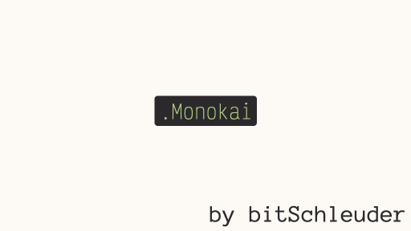
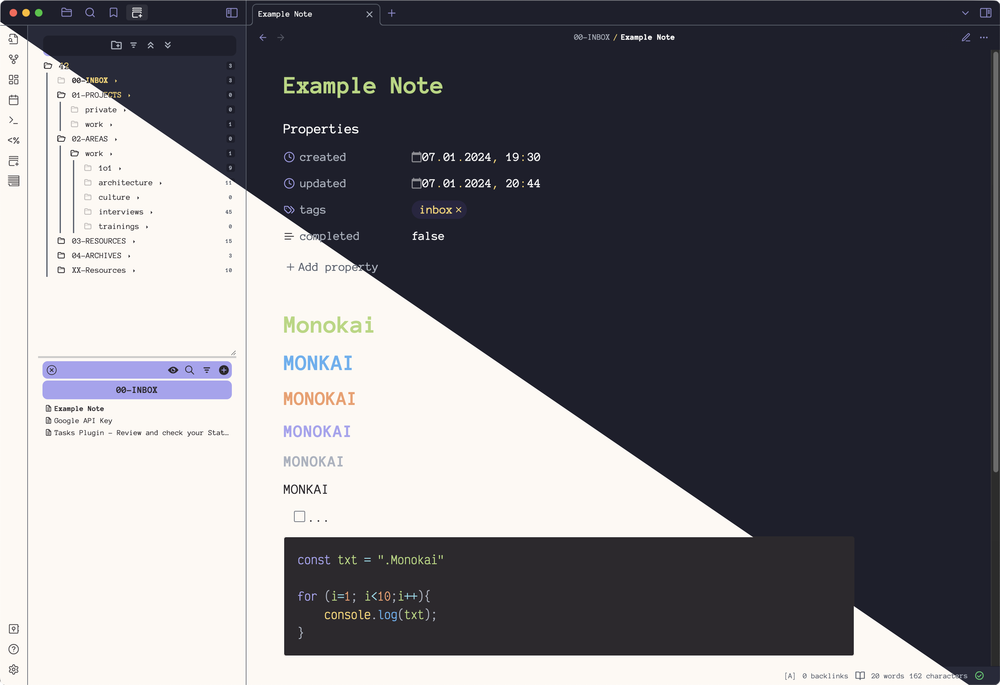
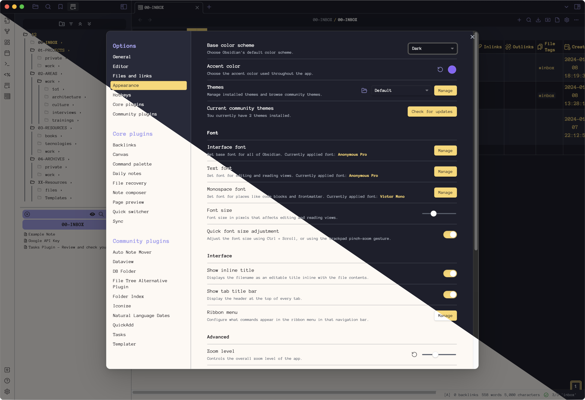

### Description

This theme is inspired by the great editor theme [Monokai Pro](https://monokai.pro/), developed by [Wimer Hazenberg](https://monokai.nl/). I use the colour palette in every editor I use, now also in Obsidian. *Enjoy and have fun!*

#### Notes editing scene

#### Preferences scene

### Setup

I configured Obsidian with two fonts:
1. [Anonymous Pro](https://fonts.google.com/specimen/Anonymous+Pro) for Interface and Text font
2. [Victor Mono](https://rubjo.github.io/victor-mono/) for the Monospace font

### Plugin Support
- DB Folder
- Dataview

### Release Notes

#### 1.0.0
Initial release
